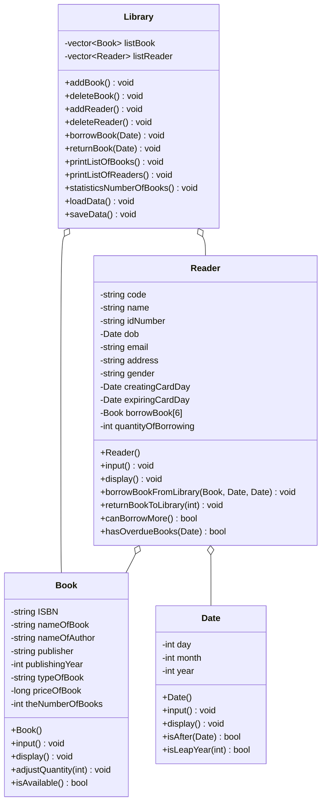

# Procedural to OOP Conversion Report
## Library Management System

### 1. Introduction

**Original Code:** Procedural C/C++ Library Management System  
**Target:** Object-Oriented C++ Implementation

#### Original System Overview
The procedural version was a library management system with the following features:
- Book management (add, edit, delete, search)
- Reader management (add, edit, delete, search)
- Borrow/return book operations
- Statistical reports
- File-based data persistence

### 2. Analysis Phase

#### Prompt Used:
```
"Analyze the procedural C/C++ code in the LibManagement folder and identify:
1. All structs and their data members
2. All functions and their purposes
3. Data that belongs together
4. Operations performed on which data structures"
```

#### Identified Structures:

**1. Date struct**
- Data members: day, month, year
- Related functions: fillDate()

**2. Book struct**
- Data members: ISBN, nameOfBook, nameOfAuthor, publisher, publishingYear, typeOfBook, priceOfBook, theNumberOfBooks
- Related functions:
  - readFileOfListBook()
  - exportNewFileOfBook()
  - printListOfBooks()
  - checkValidISBN()
  - checkValidCharacter()
  - toUpper()
  - addBook()
  - adjustInformationOfBook()
  - deleteInformationOfBook()
  - findBookByISBN()
  - findBookByName()

**3. Reader struct**
- Data members: code, name, idNumber, dob (Date), email, address, gender, creatingCardDay (Date), expiringCardDay (Date), borrowBook[] (array of Books), quantityOfBorrowing, borrowDay[], returnDay[]
- Related functions:
  - readFileOfListReaders()
  - exportNewFile()
  - printListOfReaders()
  - checkValidCode()
  - checkValidID()
  - addReader()
  - adjustInformation()
  - deleteInformation()
  - findReaderByCitizenIdNumber()
  - findBookByNameOfReader()

**4. Global/Utility Functions:**
- menu.cpp: printMenu(), printMenuOfFunction1(), printMenuOfFunction2(), printMenuOfFunction5()
- borrow.cpp: borrowingBook()
- return.cpp: returnBook()
- statistics.cpp: various statistics functions

### 3. Design Phase

#### Prompt Used:
```
"Design an OOP class structure for the Library Management System where:
1. Each struct becomes a class with private data members
2. Related functions become class methods
3. Create a Library class to manage collections
4. Use proper encapsulation (private/public)
5. Add constructors, getters, setters where appropriate"
```

#### Designed Classes:

**Class 1: Date**
- Purpose: Represent and validate dates
- Private Attributes:
  - int day
  - int month
  - int year
- Public Methods:
  - Constructors: Date(), Date(int, int, int), Date(const Date&)
  - Getters: getDay(), getMonth(), getYear()
  - Setters: setDay(), setMonth(), setYear()
  - input(), display()
  - Static: isValidDate(), isLeapYear()
  - Comparison: isAfter(), isBefore(), daysDifference()

**Class 2: Book**
- Purpose: Represent a book entity with validation
- Private Attributes:
  - string ISBN
  - string nameOfBook
  - string nameOfAuthor
  - string publisher
  - int publishingYear
  - string typeOfBook
  - long priceOfBook
  - int theNumberOfBooks
- Private Helper Methods:
  - isValidISBN()
  - isValidCharacter()
  - toUpperCase()
- Public Methods:
  - Constructors: Book(), Book(...parameters), Book(const Book&)
  - Getters: getISBN(), getNameOfBook(), etc.
  - Setters: setISBN(), setNameOfBook(), etc.
  - input(), display()
  - adjustQuantity(int delta)
  - isAvailable()

**Class 3: Reader**
- Purpose: Represent a library member
- Private Attributes:
  - string code
  - string name
  - string idNumber
  - Date dob
  - string email
  - string address
  - string gender
  - Date creatingCardDay
  - Date expiringCardDay
  - Book borrowBook[6]
  - int quantityOfBorrowing
  - Date borrowDay[6]
  - Date returnDay[6]
- Private Helper Methods:
  - isValidCode()
  - isValidID()
  - isValidCharacter()
  - toUpperCase()
- Public Methods:
  - Constructors: Reader(), Reader(...parameters), Reader(const Reader&)
  - Getters: getCode(), getName(), etc.
  - Setters: setCode(), setName(), etc.
  - input(), display()
  - canBorrowMore()
  - borrowBookFromLibrary()
  - returnBookToLibrary()
  - hasOverdueBooks()
  - displayBorrowedBooks()

**Class 4: Library**
- Purpose: Manage collections of books and readers
- Private Attributes:
  - vector<Book> listBook
  - vector<Reader> listReader
- Private Helper Methods:
  - readBooksFromFile()
  - writeBooksToFile()
  - readReadersFromFile()
  - writeReadersToFile()
- Public Methods:
  - Book Management: printListOfBooks(), addBook(), adjustBook(), deleteBook(), findBookByISBN(), findBookByName()
  - Reader Management: printListOfReaders(), addReader(), adjustReader(), deleteReader(), findReaderByCitizenId(), findBooksByReaderName()
  - Operations: borrowBook(), returnBook()
  - Statistics: statisticsNumberOfBooks(), statisticsNumberOfBooksByType(), statisticsNumberOfReaders(), statisticsGender(), statisticsBooksBorrowed(), statisticsOverdueReaders()
  - File I/O: loadData(), saveData()

### 4. Implementation Phase

#### Conversion Steps

**Step 1: Create Date Class**
*Prompt:* "Convert the Date struct and fillDate() function into a Date class with proper encapsulation"

- Created Date.h with class declaration
- Moved day, month, year to private section
- Created public getters/setters
- Converted fillDate() to input() method
- Added validation methods
- Added comparison methods for date operations

**Step 2: Create Book Class**
*Prompt:* "Convert the book struct and all book-related functions into a Book class"

- Created Book.h with class declaration
- Used std::string instead of char arrays for better C++ practices
- Moved all attributes to private section
- Converted validation functions to private helper methods
- Converted global functions to public methods:
  - addBook logic → input() method
  - Print logic → display() method
  - Validation functions → private helper methods
- Added adjustQuantity() for inventory management
- Added isAvailable() to check stock

**Step 3: Create Reader Class**
*Prompt:* "Convert the reader struct and all reader-related functions into a Reader class, including borrow/return functionality"

- Created Reader.h with class declaration
- Used std::string for text fields
- Embedded Date objects for date fields
- Embedded Book array for borrowed books
- Converted validation functions to private helpers
- Converted operations to methods:
  - addReader logic → input() method
  - Print logic → display() method
  - Borrow logic → borrowBookFromLibrary() method
  - Return logic → returnBookToLibrary() method
- Added canBorrowMore() to enforce 6-book limit
- Added hasOverdueBooks() for deadline checking

**Step 4: Create Library Class**
*Prompt:* "Create a Library class that manages collections of Books and Readers using std::vector"

- Created Library.h with class declaration
- Used std::vector<Book> and std::vector<Reader> for dynamic collections
- Moved file I/O functions to private methods
- Converted management functions to public methods
- Grouped related operations logically

**Step 5: Refactor Main Function**
*Prompt:* "Refactor main.cpp to use the new OOP structure with a Library object"

- Created single Library object
- Replaced direct array access with Library methods
- Simplified menu handling
- Maintained same user interface

### 5. Key Improvements in OOP Version

**1. Encapsulation**
- All data is private
- Access only through public methods
- Internal validation hidden from users

**2. Better Data Management**
- std::vector instead of fixed arrays
- std::string instead of char arrays
- Automatic memory management

**3. Code Organization**
- Related data and functions grouped in classes
- Clear separation of concerns
- Each class has single responsibility

**4. Maintainability**
- Changes to Book don't affect Reader
- Validation logic centralized in classes
- Easier to add new features

**5. Reusability**
- Date class can be reused in other projects
- Book and Reader classes are self-contained
- Library class encapsulates all business logic

### 6. Class Diagram



### 7. Complete Class List

#### Class: Date
**Attributes:**
- `private int day`
- `private int month`
- `private int year`

**Methods:**
- `public Date()` - Default constructor
- `public Date(int d, int m, int y)` - Parameterized constructor
- `public Date(const Date& other)` - Copy constructor
- `public int getDay() const` - Getter
- `public int getMonth() const` - Getter
- `public int getYear() const` - Getter
- `public void setDay(int d)` - Setter
- `public void setMonth(int m)` - Setter
- `public void setYear(int y)` - Setter
- `public void input()` - Read date from user
- `public void display() const` - Display date
- `public static bool isValidDate(int d, int m, int y)` - Validate date
- `public static bool isLeapYear(int y)` - Check leap year
- `public bool isAfter(const Date& other) const` - Compare dates
- `public bool isBefore(const Date& other) const` - Compare dates
- `public int daysDifference(const Date& other) const` - Calculate difference

#### Class: Book
**Attributes:**
- `private string ISBN`
- `private string nameOfBook`
- `private string nameOfAuthor`
- `private string publisher`
- `private int publishingYear`
- `private string typeOfBook`
- `private long priceOfBook`
- `private int theNumberOfBooks`

**Methods:**
- `public Book()` - Default constructor
- `public Book(...)` - Parameterized constructor
- `public Book(const Book& other)` - Copy constructor
- `public Book& operator=(const Book& other)` - Assignment operator
- `public string getISBN() const` - Getter
- `public string getNameOfBook() const` - Getter
- `public string getNameOfAuthor() const` - Getter
- `public string getPublisher() const` - Getter
- `public int getPublishingYear() const` - Getter
- `public string getTypeOfBook() const` - Getter
- `public long getPriceOfBook() const` - Getter
- `public int getTheNumberOfBooks() const` - Getter
- `public void setISBN(const string& isbn)` - Setter
- `public void setNameOfBook(const string& name)` - Setter
- `public void setNameOfAuthor(const string& author)` - Setter
- `public void setPublisher(const string& pub)` - Setter
- `public void setPublishingYear(int year)` - Setter
- `public void setTypeOfBook(const string& type)` - Setter
- `public void setPriceOfBook(long price)` - Setter
- `public void setTheNumberOfBooks(int quantity)` - Setter
- `public void input()` - Read book data from user
- `public void display() const` - Display book information
- `public void adjustQuantity(int delta)` - Adjust stock quantity
- `public bool isAvailable() const` - Check if book is in stock
- `private bool isValidISBN(const string& isbn) const` - Validate ISBN
- `private bool isValidCharacter(const string& str) const` - Validate text
- `private void toUpperCase(string& str)` - Convert to uppercase

#### Class: Reader
**Attributes:**
- `private string code`
- `private string name`
- `private string idNumber`
- `private Date dob`
- `private string email`
- `private string address`
- `private string gender`
- `private Date creatingCardDay`
- `private Date expiringCardDay`
- `private Book borrowBook[6]`
- `private int quantityOfBorrowing`
- `private Date borrowDay[6]`
- `private Date returnDay[6]`

**Methods:**
- `public Reader()` - Default constructor
- `public Reader(...)` - Parameterized constructor
- `public Reader(const Reader& other)` - Copy constructor
- `public Reader& operator=(const Reader& other)` - Assignment operator
- `public string getCode() const` - Getter
- `public string getName() const` - Getter
- `public string getIdNumber() const` - Getter
- `public Date getDob() const` - Getter
- `public string getEmail() const` - Getter
- `public string getAddress() const` - Getter
- `public string getGender() const` - Getter
- `public Date getCreatingCardDay() const` - Getter
- `public Date getExpiringCardDay() const` - Getter
- `public int getQuantityOfBorrowing() const` - Getter
- `public Book getBorrowBook(int index) const` - Getter
- `public Date getBorrowDay(int index) const` - Getter
- `public Date getReturnDay(int index) const` - Getter
- `public void setCode(const string& c)` - Setter
- `public void setName(const string& n)` - Setter
- `public void setIdNumber(const string& id)` - Setter
- `public void setDob(const Date& d)` - Setter
- `public void setEmail(const string& e)` - Setter
- `public void setAddress(const string& a)` - Setter
- `public void setGender(const string& g)` - Setter
- `public void setCreatingCardDay(const Date& d)` - Setter
- `public void input()` - Read reader data from user
- `public void display() const` - Display reader information
- `public bool canBorrowMore() const` - Check if can borrow more books
- `public void borrowBookFromLibrary(const Book&, const Date&, const Date&)` - Borrow book
- `public void returnBookToLibrary(int)` - Return book
- `public bool hasOverdueBooks(const Date&) const` - Check overdue books
- `public void displayBorrowedBooks() const` - Show borrowed books
- `private bool isValidCode(const string&) const` - Validate code
- `private bool isValidID(const string&) const` - Validate ID
- `private bool isValidCharacter(const string&) const` - Validate text
- `private void toUpperCase(string&)` - Convert to uppercase

#### Class: Library
**Attributes:**
- `private vector<Book> listBook`
- `private vector<Reader> listReader`

**Methods:**
- `public Library()` - Constructor
- `public void printListOfBooks()` - Display all books
- `public void addBook()` - Add new book
- `public void adjustBook()` - Edit book information
- `public void deleteBook()` - Remove book
- `public void findBookByISBN()` - Search book by ISBN
- `public void findBookByName()` - Search book by name
- `public int getNumberOfBooks() const` - Get book count
- `public Book& getBook(int index)` - Get book by index
- `public void printListOfReaders()` - Display all readers
- `public void addReader()` - Add new reader
- `public void adjustReader()` - Edit reader information
- `public void deleteReader()` - Remove reader
- `public void findReaderByCitizenId()` - Search reader by ID
- `public void findBooksByReaderName()` - Find reader's borrowed books
- `public int getNumberOfReaders() const` - Get reader count
- `public Reader& getReader(int index)` - Get reader by index
- `public void borrowBook(const Date&)` - Process book borrowing
- `public void returnBook(const Date&)` - Process book return
- `public void statisticsNumberOfBooks()` - Show book statistics
- `public void statisticsNumberOfBooksByType()` - Show books by type
- `public void statisticsNumberOfReaders()` - Show reader count
- `public void statisticsGender()` - Show gender statistics
- `public void statisticsBooksBorrowed()` - Show borrowed books stats
- `public void statisticsOverdueReaders(const Date&)` - Show overdue readers
- `public void loadData()` - Load data from files
- `public void saveData()` - Save data to files
- `private void readBooksFromFile(const string&)` - Read books
- `private void writeBooksToFile(const string&)` - Write books
- `private void readReadersFromFile(const string&)` - Read readers
- `private void writeReadersToFile(const string&)` - Write readers

### 8. Compilation and Testing

**Compilation Command:**
```bash
g++ -std=c++11 Date.cpp Book.cpp Reader.cpp Library.cpp Main.cpp -o LibraryOOP.exe
```

**Testing Checklist:**
- ✓ All classes compile without errors
- ✓ Proper encapsulation enforced
- ✓ Data validation works correctly
- ✓ File I/O maintains compatibility
- ✓ Same functionality as procedural version

### 9. Benefits Achieved

**Code Quality:**
- Better organization and structure
- Clear separation of concerns
- Improved maintainability

**Safety:**
- Data encapsulation prevents invalid states
- Validation centralized in classes
- Type safety with std::string and std::vector

**Flexibility:**
- Easy to extend with new features
- Classes can be reused independently
- Changes are localized to specific classes

**Modern C++:**
- Uses STL containers (vector, string)
- Follows C++ best practices
- Object-oriented design patterns

### 10. Conclusion

The conversion from procedural to object-oriented programming was successful. The OOP version maintains all functionality of the original while providing:

1. **Better Code Organization** - Related data and functions grouped into classes
2. **Encapsulation** - Private data protected from invalid access
3. **Maintainability** - Easier to understand, modify, and extend
4. **Reusability** - Classes can be used in other projects
5. **Modern C++** - Uses STL and follows best practices

The new structure makes the codebase more professional, easier to maintain, and ready for future enhancements such as database integration, GUI implementation, or network capabilities.
